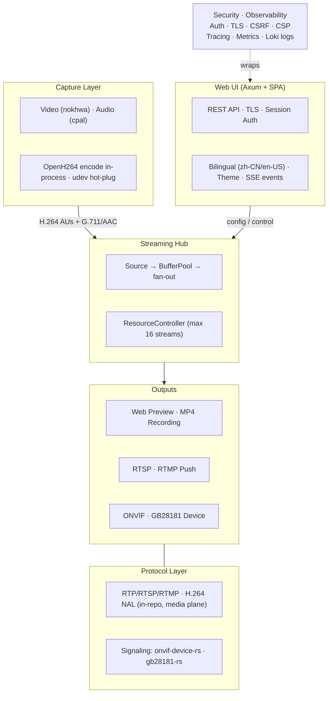

# mibee-eye-notebook

[](LICENSE)
[](https://www.rust-lang.org/)
[](docs/POSITIONING.md)
[](docs/en/contributing.md)

[中文文档](README.zh-CN.md) · [Documentation](docs/en/) · [**Product Positioning**](docs/POSITIONING.md)

**PC-local webcam & microphone capture agent.** Captures only physically-attached devices (USB webcam, built-in/USB mic) from THIS machine, exposes them through a TLS-gated Web UI as the primary control surface. Outbound streaming to NVRs / live platforms is **available but default-off**, enabled per-protocol via Web UI.

Part of the **MiBee Eye** camera family: [mibee-eye-rs](https://github.com/xiqing85/mibee-eye-rs) · [mibee-eye-go](https://github.com/xiqing85/mibee-eye-go) · [mibee-eye-webui](https://github.com/xiqing85/mibee-eye-webui) (shared frontend + API spec).

> The binary and systemd service keep the historical name `mibee-rec`.

## Features

- **Local capture** — webcam via V4L2 (Linux) / MSMF (Windows), microphone via ALSA / WASAPI
- **Outbound protocols** — RTSP server (clients pull), RTMP push, ONVIF device endpoint, GB/T 28181 device registration (all default-OFF, enabled via Web UI)
- **GB/T 28181-2022 device surface** — alarm events (SSE `alarm` + Alarm NOTIFY, AI rising-edge with cooldown), DeviceControl (IFrameCmd force-keyframe, RecordCmd recording gate), graceful deregistration (REGISTER Expires: 0), static MobilePosition reporting, Catalog/DeviceInfo/keepalive per the shared gb28181-rs library
- **H.264 / H.265** — hand-written NAL unit parser, keyframe detection, SPS/PPS extraction
- **MiBee NVR integration** — REST API client, camera sync, SSE event stream
- **Web UI** — Axum REST API + embedded SPA, TLS via rustls, session-based auth, bilingual (zh-CN / en-US), day/night theme
- **Local recording** — MP4 segment archive with auto-prune, configurable per-camera
- **Browser preview** — MJPEG multipart live stream, JPEG snapshot endpoint
- **Resource-bounded** — semaphore-guarded concurrency (max 16 streams), per-stream memory budgets
- **Observable** — structured logging, OpenTelemetry traces (132+ instrumented spans), Prometheus metrics (14+ counters/gauges), optional Loki remote log shipping
- **Security** — rate limiting with exponential backoff, CSRF (double-submit cookie), CSP header, TLS-only
- **Dynamic management** — protocol hot-toggle via Web UI (no restart needed), hot-plug camera detection (udev), SSE real-time events
- **Low footprint** — targets <5% CPU idle, <200 MB RAM; zero-copy where possible

### Crate Responsibilities

| Crate | LOC | Role |
|-------|-----|------|
| `protocols` | ~11k | Media-plane protocol implementations: RTSP, RTMP, RTP, H.264 (signaling protocols come from the shared protocol libraries) |
| `streaming` | ~4k | StreamHub fan-out orchestrator (to Web Preview, File Output, RTSP, RTMP, ONVIF, GB28181), source/output adapters, MiBee NVR client |
| `web` | ~2.5k | Axum REST API + embedded SPA + TLS via rustls + i18n + theme |
| `security` | ~1.9k | Session-based auth, rate limiting, CSRF protection, encryption |
| `capture` | ~800 | Video (nokhwa) + Audio (cpal) device wrappers |
| `observability` | ~423 | Structured tracing, OpenTelemetry export, Prometheus metrics, Loki remote log shipping |

## Architecture



## Workspace Layout

```
mibee-rec/
├─ src/                # Binary entry, config, types, error
├─ crates/
│  ├─ protocols/       # RTSP, RTMP, ONVIF, GB28181, RTP, H.264
│  ├─ streaming/       # StreamHub fan-out, source/output adapters, MiBee client
│  ├─ web/             # Axum REST API + embedded SPA + TLS
│  ├─ security/        # Auth, TLS, encryption, rate limiting
│  ├─ capture/         # Video + Audio capture wrappers
│  └─ observability/   # tracing + OTel + Prometheus
├─ migrations/         # SQLite schema
└─ config.toml         # Default runtime config
```

## Protocol Support Status

| Area | Component | Implementation | Runtime status |
|------|-----------|----------------|----------------|
| **Auth (login/logout/setup/reset)** | Session-based | bcrypt + 24h session + rate limit + exponential backoff lockout | ✅ Implemented & wired in |
| **TLS (rustls)** | HTTPS only, no HTTP | Auto self-signed dev cert, hot-reload | ✅ Implemented & wired in |
| **RTSP Server** | RFC 2326 + Digest auth + RTP interleaved | Hand-written (`RtspServer`) | ✅ Wired into runtime |
| **RTMP Push** | Handshake + connect + publish | Hand-written (`RtmpOutput`, auto-attached via StreamHub when `rtmp_push.enabled=true`) | ✅ Implemented & wired in |
| **ONVIF Device** | WS-Discovery + SOAP device service | [`onvif-device-rs`](https://github.com/mickeyzzc/onvif-rs) (starts when `onvif.enabled=true`) | ✅ Implemented & wired in |
| **GB/T 28181 Device** | SIP REGISTER (Digest) + INVITE + RTP push | [`gb28181-rs`](https://github.com/mickeyzzc/gb28181-rs) (incl. GB35114 auth; `Gb28181Output` dynamically attached on INVITE, detached on BYE) | ✅ Implemented & wired in |
| **GB28181 alarm pipeline** | AI detection rising edge → `alarm` SSE + Alarm NOTIFY | `AlarmBridge` (cooldown-gated) + gb28181-rs `notifier()`; priority 4 / method 5 / type 2 (2022 table) | ✅ Implemented & wired in |
| **GB28181 DeviceControl** | IFrameCmd / RecordCmd / GuardCmd / TeleBoot / PTZ | gb28181-rs control handler: force-keyframe via OpenH264, RecordCmd gates local recording, no-actuator commands ack-only | ✅ Implemented & wired in |
| **GB28181 graceful deregistration** | REGISTER `Expires: 0` on SIGTERM / protocol stop | gb28181-rs `shutdown_with_deregister` (401 dance, 2s timeouts, abort guard) | ✅ Implemented & wired in |
| **GB28181 MobilePosition** | static coordinates on subscription cadence | gb28181-rs `with_position_source` (empty config = no reporting) | ✅ Implemented & wired in |
| **H.264** | NAL unit parser, SPS/PPS, keyframe detection | Hand-written (`H264Parser`) | ✅ Used by all video outputs |
| **H.265 decode** | Browser fallback to H.264 | — | ⚠️ Not universal in browsers; H.264 only for v1 |
| **Browser live preview** | MJPEG multipart stream via `` | `/api/cameras/{id}/live` route (ffmpeg transcode) | ✅ Implemented & wired in |
| **Local recording** | MP4 segment archive with auto-prune | `FileOutput` auto-attached per-camera based on recording config | ✅ Implemented & wired in |
| **i18n (zh-CN / en-US)** | Translation layer | `t()` dictionary in `app.js`, language toggle persisted to user settings | ✅ Implemented & wired in |
| **Day/night theme** | Theme toggle | System-preference auto-detect, manual override persisted | ✅ Implemented & wired in |
| **CSRF / CSP** | Double-submit cookie + strict header | CSRF token on login, verified via `X-CSRF-Token` header; strict CSP header | ✅ Implemented & wired in |
| **Remote log shipping** | Loki / OTLP logs | `tracing-loki` layer with batch + flush interval, fail-open | ✅ Implemented & wired in |
| **OTel traces** | OTLP gRPC exporter | Pipeline wired + 132 `#[tracing::instrument]` spans across handlers and critical paths | ✅ Implemented & wired in |
| **Prometheus metrics** | Counters/gauges | 14+ custom metrics at `/metrics` endpoint | ✅ Implemented & wired in |
| **Rate limiting** | Per-IP fixed window | `parking_lot::Mutex`-guarded, resets on successful login, exponential backoff after 5 failures | ✅ Implemented & wired in |
| **Protocol hot-toggle** | Start/stop without restart | `ProtocolRuntime` starts/stops ONVIF/GB28181/RTMP via Web UI | ✅ Implemented & wired in |
| **Hot-plug monitor** | Camera add/remove | udev netlink ADD/REMOVE auto-discovers plugged cameras, marks unplugged offline | ✅ Implemented & wired in |
| **SSE event bus** | Real-time events | `/api/events` pushes camera add/offline events to browser | ✅ Implemented & wired in |
| **Cross-platform: Windows** | MSMF + WASAPI | — | ❌ Does not compile (planned Tier 2, blockers: `libc::getifaddrs` POSIX-only) |
| **Cross-platform: macOS** | AVFoundation + CoreAudio | — | ❌ Planned Tier 2 (would compile but `/dev/videoN` paths don't exist) |

**Legend**: ✅ Working · ⚠️ Limited/fallback · ❌ Missing/Not supported


See [`docs/POSITIONING.md`](docs/POSITIONING.md) for the authoritative product scope.

## Resource Targets

| Metric | Target | Mechanism |
|--------|--------|-----------|
| CPU (idle) | <5% | Zero-copy I/O, async everywhere, no busy loops |
| Memory | <200 MB | `BufferPool` (10 MB pool), per-stream budgets, `ResourceController` |
| Concurrent streams | ≤16 | `tokio::sync::Semaphore`-guarded in `ResourceController` |
| First frame latency | <500 ms | Minimal buffering, eager keyframe detection |

## Quick Start

```bash
# Clone and enter
git clone https://github.com/xiqing85/mibee-eye-notebook.git
cd mibee-eye-notebook

# Install system dependencies (Linux)
sudo apt install libv4l-dev libasound2-dev libclang-dev
sudo usermod -aG video $USER
# Log out and back in for group change to take effect

# Build
cargo build --release

# Configure
cp config.toml config.local.toml
# Edit config.local.toml as needed

# Run
cargo run --release -- --config config.local.toml
```

## Building

**Prerequisites (Linux):**

```bash
# Install system dependencies
sudo apt install libv4l-dev libasound2-dev libclang-dev

# Add user to video group for webcam access
sudo usermod -aG video $USER
# Log out and back in for group change to take effect
```

**Build & Run:**

```bash
cargo build                                # Debug build
cargo build --release                      # Release build
cargo run -- --config config.toml          # Run with config
cargo run -- --reset-password              # Password reset CLI
```

**Development:**

```bash
cargo test                                 # Run all tests
cargo test -p protocols                    # Test single crate
cargo ci-clippy                            # Lint (clippy -D warnings)
cargo fmt-check                            # Format check
```

## Configuration

Copy and edit the default config:

```bash
cp config.toml config.local.toml
```

`config.local.toml` is gitignored — put local overrides there.

Default ports: web UI `8443` (TLS), RTSP `8554`, RTMP `1935`.

## Documentation

Full documentation is available under [docs/en/](docs/en/):

- [Getting Started](docs/en/getting-started.md)
- [Installation](docs/en/installation.md)
- [Configuration](docs/en/configuration.md)
- [API Reference](docs/en/api.md)
- [Architecture](docs/en/architecture.md)
- [Contributing](docs/en/contributing.md)

Chinese documentation: [README.zh-CN.md](README.zh-CN.md) | [docs/zh/](docs/zh/)

---


## License

Licensed under [Apache-2.0](LICENSE).
