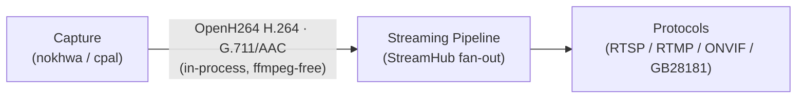
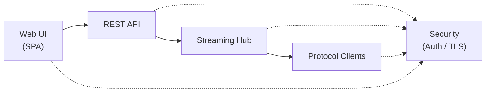

# Architecture Design Document

## Overview

mibee-rec is a **PC-local webcam & microphone capture agent** built in Rust. It captures video and audio from devices **physically attached to this machine** (USB webcams, built-in/USB microphones) via V4L2/ALSA, and distributes the captured stream through outbound protocols (RTSP server, RTMP push, ONVIF device, GB/T 28181 device) to external NVRs and live platforms. The architecture prioritizes security (TLS-only, authenticated), low resource usage, minimal dependencies, Linux-first development, and local-first (air-gapped) deployment. It does **not** discover or pull from remote network cameras.

### Design Goals

- **Security first**: All external access requires encryption (TLS) and authentication. No anonymous access to streams or control surfaces.
- **Low resource usage**: Targets <5% CPU idle, <200MB RAM using zero-copy async I/O throughout the pipeline.
- **Minimal dependencies**: Prefers hand-written codec and protocol implementations. Only adds crates for genuinely hard problems (TLS, async runtime, platform ABI).
- **Linux priority**: V4L2/ALSA are first-class (Tier 1 — the only platform that compiles end-to-end today). Windows (MSMF/WASAPI) and macOS (AVFoundation/CoreAudio) are planned Tier 2.
- **Local-first**: Development, testing, and production run on the same laptop. Exact commands provided for privileged operations.

## Workspace Layout

The project uses a Rust workspace with 6 specialized crates:

```
mibee-rec/
├─ src/                # Binary entry (main.rs), config, types
├─ crates/
│  ├─ capture/         # Video (nokhwa) + Audio (cpal) + hot-plug (udev)
│  ├─ protocols/       # RTSP server, RTMP push, ONVIF, GB28181, RTP, H.264, RTCP
│  ├─ streaming/       # StreamHub fan-out, CaptureSource adapter, Output adapters, MiBee client
│  ├─ web/             # Axum REST API + embedded SPA + TLS + i18n + ProtocolRuntime
│  ├─ security/        # Auth (bcrypt sessions), TLS (rustls), rate limiting, CSRF, password hashing
│  └─ observability/   # tracing + OTel + Prometheus + Loki log shipping
├─ migrations/         # SQLite schema (cameras, settings, stream_sessions, users, sessions, protocol_configs)
├─ config.toml         # Default runtime config
└─ tls/                # Development TLS certificates (gitignored in prod)
```

## Dependency Graph

```
root (main.rs) → observability, web, security
web → security, observability, protocols  
streaming → protocols
capture → (standalone leaf)
```

## Core Abstractions

### MediaFrame

The fundamental unit of media data flowing through the pipeline:

```rust
pub enum MediaFrame {
    Video {
        keyframe: bool,        // Whether this frame is a keyframe (IDR)
        data: Vec<u8>,        // Raw NAL unit data (Annex B or AVCC format)
        timestamp: u64,       // Presentation timestamp in milliseconds
    },
    Audio {
        data: Vec<u8>,        // Raw audio data (PCM/G.711)
        timestamp: u64,       // Presentation timestamp in milliseconds
    },
}
```

### Source Trait

Async producer of media frames:

```rust
pub trait Source: Send + 'static {
    /// Start the source (open device / connect to stream)
    fn start(&mut self) -> Pin<Box<dyn Future<Output = Result<()>> + Send + '_>>;
    
    /// Produce the next frame (blocks asynchronously until available)
    fn next_frame(&mut self) -> Pin<Box<dyn Future<Output = Result<MediaFrame>> + Send + '_>>;
    
    /// Stop the source and release resources
    fn stop(&mut self) -> Pin<Box<dyn Future<Output = Result<()>> + Send + '_>>;
}
```

### Output Trait

Async consumer of media frames:

```rust
pub trait Output: Send + 'static {
    /// Start the output (open connection / bind listener)
    fn start(&mut self) -> Pin<Box<dyn Future<Output = Result<()>> + Send + '_>>;
    
    /// Deliver a frame to the output
    fn send_frame(&mut self, frame: &MediaFrame) -> Pin<Box<dyn Future<Output = Result<()>> + Send + '_>>;
    
    /// Stop the output and release resources  
    fn stop(&mut self) -> Pin<Box<dyn Future<Output = Result<()>> + Send + '_>>;
}
```

### StreamHub

Central fan-out orchestrator that connects one source to multiple outputs:

- **Broadcast channel**: Uses `tokio::sync::broadcast::channel(300)` for frame distribution (increased from 64 to prevent IDR frame drops during MJPEG preview)
- **Decoupled processing**: Source frame rate independent from output processing speed
- **Dynamic output management**: Outputs can be added/removed while streaming
- **Task-based architecture**: Source and each output run as separate tokio tasks
- **Graceful degradation**: Slow outputs lag and potentially drop frames without blocking source

## Resource Management

The streaming pipeline integrates four complementary resource control systems:

### BufferPool

Per-stream memory pool with best-fit recycling strategy:

```rust
pub struct BufferPool {
    inner: Arc<Mutex<PoolInner>>,
    max_bytes: usize,  // 10 MB per stream budget
}
```

- **10 MB per-stream memory budget** enforced at the pool level
- **Best-fit allocation**: Finds largest available buffer ≥ required size
- **Automatic recycling**: Buffers returned to pool on drop if within budget
- **Zero-copy optimization**: Reuses allocations when possible

### ResourceController

Semaphore-based concurrency limiter:

```rust
pub struct ResourceController {
    max_streams: usize,           // Maximum concurrent streams
    semaphore: Arc<Semaphore>,    // Tracks available stream slots
}
```

- **16 concurrent streams maximum** enforced by tokio::sync::Semaphore
- **Blocking acquisition**: `acquire()` waits until slot available
- **Non-blocking alternative**: `try_acquire()` returns immediately if no slots
- **Stream permits**: Each stream holds a `StreamPermit` that releases slot on drop

### StreamBudget

Per-stream allocation tracker:

```rust
pub struct StreamBudget {
    inner: Arc<Mutex<HashMap<Uuid, usize>>>,
    max_per_stream: usize,  // 10 MB default
}
```

- **Per-stream memory tracking** prevents any single stream from consuming excessive memory
- **Reservation system**: `try_alloc()` reserves bytes before use
- **Budget enforcement**: Returns 503 error when limit exceeded
- **Automatic cleanup**: Released when streams stop or budgets removed

### StreamLifecycle

State machine for stream lifecycle management:

```rust
#[derive(Debug, Clone, Copy, PartialEq, Eq, Hash)]
pub enum StreamState {
    Starting,  // Stream is being set up
    Running,   // Stream is actively running  
    Stopping,  // Stream is being torn down gracefully
    Stopped,   // Stream has stopped
    Error,     // Stream encountered an error
}
```

- **State transitions**: Enforces valid state changes (Starting → Running → Stopping → Stopped)
- **Observable states**: `StreamHandle` provides state observation and subscription
- **Error handling**: Streams in Error state can be restarted
- **Stream management**: Tracks active streams and provides lifecycle callbacks

## Stream Lifecycle State Machine

```
Starting → Running → Stopping → Stopped
   ↑                      ↓
   └──────→ Error ←───────┘
```

- **Starting**: Stream initialization, resource acquisition
- **Running**: Active frame production and distribution
- **Stopping**: Graceful shutdown, resource cleanup
- **Stopped**: Stream completed, resources freed
- **Error**: unrecoverable failure, can restart from Stopped or Error

## Data Flow

### Capture → Streaming Pipeline



**Note**: The CaptureSource adapter (`crates/streaming/src/capture_source.rs`) bridges nokhwa video capture and cpal audio capture into the streaming pipeline with **fully in-process encoding** — OpenH264 for H.264 video (with `force_keyframe()` backing the GB28181 IFrameCmd), G.711/AAC for audio. There is no ffmpeg dependency anywhere in the runtime.

### HTTP → API → Streaming → Protocol Clients



## Current Limitations

1. **Windows / macOS**: Do not compile yet (planned Tier 2). Blockers: `libc::getifaddrs` is POSIX-only, `#[cfg(unix)]` guards without Windows fallbacks, hardcoded `/dev/videoN` paths.
2. **H.265 web preview**: Not universal in browsers — the web pipeline uses H.264/MJPEG only.
3. ~~No motion detection / computer vision~~: on-device AI object detection (NanoDet-Plus, SPEC v1 §4.6) shipped — including the `alarm` SSE event and GB28181 Alarm NOTIFY pipeline.

## Implemented Systems (beyond core pipeline)

### TLS & Authentication
- **TLS-only** (rustls, never OpenSSL): self-signed dev certs auto-generated on first run; hot-reload on certificate file mtime change.
- **Session auth**: bcrypt-hashed admin credentials, 24h session cookies (`HttpOnly; Secure; SameSite=Strict`), 5-min expired-session cleanup task.
- **Rate limiting**: per-IP fixed window on auth endpoints (default 20/60s), resets on successful login.
- **Login lockout**: exponential backoff per-user after 5 failures (60s → 120s → 240s → ...).
- **CSRF**: double-submit cookie pattern (CSRF token issued on login, verified via `X-CSRF-Token` header).
- **CSP + HSTS + body size limits**: strict Content-Security-Policy, HSTS header, 10KB limit on auth routes, 1MB default.

### Protocol Hot-Toggle
`ProtocolRuntime` (`crates/web/src/protocol_runtime.rs`) starts and stops ONVIF, GB28181, and RTMP at runtime in response to Web UI toggles — **without server restart**. Protocol configs are persisted to SQLite and survive restart.

### Hot-Plug Camera Monitor
udev netlink listener (`crates/capture/src/hotplug.rs`) detects ADD/REMOVE events: auto-discovers plugged cameras and marks unplugged cameras offline (flushing their FileOutput gracefully).

### SSE Event Bus
`GET /api/events` (Server-Sent Events) pushes real-time camera add/offline events to the browser, enabling live UI updates without polling.

### Local Recording
`FileOutput` (`crates/streaming/src/output/file.rs`) writes MP4 segments to a user-configured path. Segment duration and total capacity are configurable; oldest segments are auto-pruned when capacity is reached. Per-stream enable/disable.

### i18n & Theme
- **Bilingual** (zh-CN / en-US): every user-facing string flows through a `t()` translation dictionary in `app.js`. Language toggle persists to user settings.
- **Day/night theme**: system-preference auto-detect on first run, manual toggle persists.

### Observability
- **Prometheus**: 14+ custom counters/gauges at `/metrics`.
- **OpenTelemetry traces**: 132 `#[tracing::instrument]` spans across all handlers and critical paths; OTLP gRPC export.
- **W3C TraceContext**: `traceparent` header extraction (incoming, Axum middleware) + injection (outbound HTTP).
- **Remote log shipping**: optional `tracing-loki` layer (fail-open — unreachable endpoint just logs a warning).

## Design Decisions

### Hand-Written Protocols

**Why**: Avoid heavy dependencies on GStreamer or similar media frameworks while maintaining full control over protocol edge cases and performance characteristics.

**Examples**: 
- RTSP/RTMP protocol handling for tricky scenarios like interleaved RTP/RTSP
- H.264 NAL unit parsing for keyframe detection and SPS/PPS extraction
- Custom buffer management to meet <200MB memory targets

### rustls over OpenSSL

**Why**: Security-first approach with modern cryptography, memory safety guarantees, and easier integration with async Rust ecosystems. OpenSSL's legacy C codebase presents greater security risks.

### Session-Based Authentication

**Why**: Stateless authentication per request would be complex with streaming protocols. Session-based auth provides a balance between security and protocol compatibility, especially for RTSP/RTMP which have their own auth mechanisms.

### Async-First Architecture

**Why**: Media streaming is inherently I/O-bound. Async I/O prevents blocking, enables better concurrency, and supports the required zero-copy optimizations for low resource usage.

## API Documentation

For detailed API documentation, see the [rustdoc output](api.md) generated by `cargo doc`:

```bash
cargo doc --open
```

## Performance Targets

| Metric | Target | Mechanism |
|--------|--------|-----------|
| CPU (idle) | <5% | Zero-copy I/O, async everywhere, no busy loops |
| Memory | <200 MB | BufferPool (10 MB pool), per-stream budgets, ResourceController |
| Concurrent streams | ≤16 | tokio::sync::Semaphore-guarded |
| First frame latency | <500 ms | Minimal buffering, eager keyframe detection |

## Testing

The architecture includes comprehensive test coverage:

- **Unit tests**: For individual components (BufferPool, StreamLifecycle, etc.)
- **Integration tests**: For MediaFrame handling and trait compliance
- **Mock sources/outputs**: For testing pipeline behavior without real hardware
- **Async test patterns**: Using tokio::test for async functionality
- **Round-trip serialization**: For all serializable types

## Resource Monitoring

Built-in memory profiling via `MemoryProfiler`:

```rust
let snapshot = MemoryProfiler::snapshot(&resource, &budget, &buffer_pool);
```

Captures RSS, buffer pool stats, stream counts, and per-stream allocations for performance tuning and debugging.