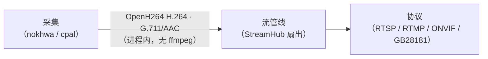
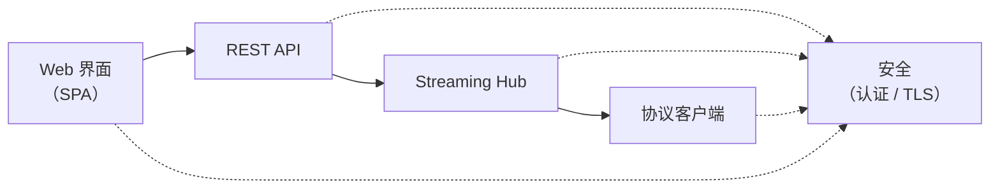

# 架构设计文档

## 概述

mibee-eye 是一个用 Rust 构建的 **PC 本地摄像头和麦克风采集代理**。它通过 V4L2/ALSA 采集**物理连接到本机**的设备（USB 摄像头、内置/USB 麦克风）的视频和音频，并通过对外协议（RTSP 服务端、RTMP 推流、ONVIF 设备端、GB/T 28181 设备端）将采集到的流分发给外部 NVR 和直播平台。架构优先考虑安全性（仅 TLS、需认证）、低资源使用、最小依赖、Linux 优先开发和本地优先（离线）部署。它**不会**发现或拉取远程网络摄像头。

### 设计目标

- **安全优先**：所有外部访问都需要加密（TLS）和身份验证。流或控制界面上无匿名访问。
- **低资源使用**：目标 <5% CPU 空闲，<200MB RAM，在整个管道中使用零拷贝异步 I/O。
- **最小依赖**：偏好手写的编解码器和协议实现。仅添加用于真正困难问题的 crate（TLS、异步运行时、平台 ABI）。
- **Linux 优先**：V4L2/ALSA 为一等公民（Tier 1 — 目前唯一能端到端编译的平台）。Windows（MSMF/WASAPI）和 macOS（AVFoundation/CoreAudio）为计划的 Tier 2。
- **本地优先**：开发、测试和生产都在同一台笔记本电脑上运行。为特权操作提供确切命令。

## 工作区布局

项目使用包含 6 个专业 crate 的 Rust 工作区：

```
mibee-eye/
├─ src/                # 二进制入口 (main.rs)，配置，类型
├─ crates/
│  ├─ capture/         # 视频 (nokhwa) + 音频 (cpal) + 热插拔 (udev)
│  ├─ protocols/       # RTSP 服务端、RTMP 推流、ONVIF、GB28181、RTP、H.264、RTCP
│  ├─ streaming/       # StreamHub 广播分发、CaptureSource 适配器、输出适配器、MiBee 客户端
│  ├─ web/             # Axum REST API + 嵌入式 SPA + TLS + i18n + ProtocolRuntime
│  ├─ security/        # 认证 (bcrypt 会话)、TLS (rustls)、限流、CSRF、密码哈希
│  └─ observability/   # tracing + OTel + Prometheus + Loki 日志推送
├─ migrations/         # SQLite 模式（摄像头、设置、流会话、用户、会话、协议配置）
├─ config.toml         # 默认运行时配置
└─ tls/                # 开发 TLS 证书（生产环境 gitignored）
```

## 依赖关系图

```
root (main.rs) → observability, web, security
web → security, observability, protocols  
streaming → protocols
capture → (standalone leaf)
```

## 核心抽象

### MediaFrame

流经管道的媒体数据的基本单元：

```rust
pub enum MediaFrame {
    Video {
        keyframe: bool,        // 此帧是否为关键帧（IDR）
        data: Vec<u8>,        // 原始 NAL 单元数据（Annex B 或 AVCC 格式）
        timestamp: u64,       // 呈现时间戳（毫秒）
    },
    Audio {
        data: Vec<u8>,        // 原始音频数据（PCM/G.711）
        timestamp: u64,       // 呈现时间戳（毫秒）
    },
}
```

### Source Trait

异步媒体帧生产者：

```rust
pub trait Source: Send + 'static {
    /// 启动源（打开设备/连接到流）
    fn start(&mut self) -> Pin<Box<dyn Future<Output = Result<()>> + Send + '_>>;
    
    /// 生成下一帧（异步阻塞直到可用）
    fn next_frame(&mut self) -> Pin<Box<dyn Future<Output = Result<MediaFrame>> + Send + '_>>;
    
    /// 停止源并释放资源
    fn stop(&mut self) -> Pin<Box<dyn Future<Output = Result<()>> + Send + '_>>;
}
```

### Output Trait

异步媒体帧消费者：

```rust
pub trait Output: Send + 'static {
    /// 启动输出（打开连接/绑定监听器）
    fn start(&mut self) -> Pin<Box<dyn Future<Output = Result<()>> + Send + '_>>;
    
    /// 向输出发送一帧
    fn send_frame(&mut self, frame: &MediaFrame) -> Pin<Box<dyn Future<Output = Result<()>> + Send + '_>>;
    
    /// 停止输出并释放资源  
    fn stop(&mut self) -> Pin<Box<dyn Future<Output = Result<()>> + Send + '_>>;
}
```

### StreamHub

中心广播分发器，将一个源连接到多个输出：

- **广播通道**：使用 `tokio::sync::broadcast::channel(300)` 进行帧分发（从 64 增加以防止 MJPEG 预览期间的 IDR 帧丢弃）
- **解耦处理**：源帧率独立于输出处理速度
- **动态输出管理**：流传输过程中可以添加/删除输出
- **基于任务架构**：源和每个输出作为独立的 tokio 任务运行
- **优雅降级**：慢速输出会延迟并可能丢弃帧，而不阻塞源

## 资源管理

流媒体管道集成了四种互补的资源控制系统：

### BufferPool

每流内存池，使用最佳匹配回收策略：

```rust
pub struct BufferPool {
    inner: Arc<Mutex<PoolInner>>,
    max_bytes: usize,  // 每流 10 MB 预算
}
```

- **每流 10MB 内存预算** 在池级别强制执行
- **最佳分配**：查找最大的可用缓冲区 ≥ 要求的大小
- **自动回收**：缓冲区在删除时如果预算允许会返回到池中
- **零拷贝优化**：可能时重用分配

### ResourceController

基于信号量的并发限制器：

```rust
pub struct ResourceController {
    max_streams: usize,           // 最大并发流数
    semaphore: Arc<Semaphore>,    // 跟踪可用流槽位
}
```

- **最多 16 个并发流** 由 tokio::sync::Semaphore 强制执行
- **阻塞获取**：`acquire()` 等待直到槽位可用
- **非阻塞替代**：`try_acquire()` 如果没有槽位则立即返回
- **流许可**：每个流持有 `StreamPermit`，在删除时释放槽位

### StreamBudget

每流分配跟踪器：

```rust
pub struct StreamBudget {
    inner: Arc<Mutex<HashMap<Uuid, usize>>>,
    max_per_stream: usize,  // 10 MB 默认值
}
```

- **每流内存跟踪** 防止任何单个流消耗过多内存
- **预订系统**：`try_alloc()` 在使用前预留字节
- **预算强制执行**：超出限制时返回 503 错误
- **自动清理**：流停止或删除预算时释放

### StreamLifecycle

流生命周期状态机：

```rust
#[derive(Debug, Clone, Copy, PartialEq, Eq, Hash)]
pub enum StreamState {
    Starting,  // 流正在设置中
    Running,   // 流正在主动运行  
    Stopping,  // 流正在被优雅关闭
    Stopped,   // 流已停止
    Error,     // 流遇到错误
}
```

- **状态转换**：强制执行有效的状态更改（Starting → Running → Stopping → Stopped）
- **可观察状态**：`StreamHandle` 提供状态观察和订阅
- **错误处理**：处于 Error 状态的流可以重新启动
- **流管理**：跟踪活动流并提供生命周期回调

## 流生命周期状态机

```
Starting → Running → Stopping → Stopped
   ↑                      ↓
   └──────→ Error ←───────┘
```

- **Starting**：流初始化，资源获取
- **Running**：主动帧生产和分发
- **Stopping**：优雅关闭，资源清理
- **Stopped**：流完成，资源释放
- **Error**：不可恢复的故障，可以从 Stopped 或 Error 重新启动

## 数据流

### 捕获 → 流媒体管道



**注意**：CaptureSource 适配器（`crates/streaming/src/capture_source.rs`）以**全进程内编码**将 nokhwa 视频采集和 cpal 音频采集桥接到流媒体管道——视频为 OpenH264 H.264（其 `force_keyframe()` 支撑 GB28181 IFrameCmd），音频为 G.711/AAC。运行时不依赖 ffmpeg。

### HTTP → API → Streaming → Protocol Clients



## 当前限制

1. **Windows / macOS**：目前无法编译（计划 Tier 2）。阻碍：`libc::getifaddrs` 仅限 POSIX、`#[cfg(unix)]` 无 Windows 回退、硬编码 `/dev/videoN` 路径。
2. **H.265 Web 预览**：浏览器支持不普遍 — Web 管道仅使用 H.264/MJPEG。
3. ~~无运动检测/计算机视觉~~：端侧 AI 目标检测（NanoDet-Plus，SPEC v1 §4.6）已上线——含 `alarm` SSE 事件与 GB28181 Alarm NOTIFY 管线。

## 已实现系统（核心管道之外）

### TLS 与身份认证
- **仅 TLS**（rustls，绝不使用 OpenSSL）：首次运行时自动生成自签名开发证书；证书文件 mtime 变化时热重载。
- **会话认证**：bcrypt 哈希管理员凭证，24 小时会话 cookie（`HttpOnly; Secure; SameSite=Strict`），5 分钟过期会话清理任务。
- **速率限制**：认证端点上的每 IP 固定窗口（默认 20/60 秒），成功登录后重置。
- **登录锁定**：5 次失败后每用户指数退避（60 秒 → 120 秒 → 240 秒 → ...）。
- **CSRF**：双提交 cookie 模式（登录时签发 CSRF 令牌，通过 `X-CSRF-Token` 头验证）。
- **CSP + HSTS + 请求体大小限制**：严格的 Content-Security-Policy、HSTS 头、认证路由 10KB 限制、默认 1MB。

### 协议热切换
`ProtocolRuntime`（`crates/web/src/protocol_runtime.rs`）在运行时响应 Web UI 开关启停 ONVIF、GB28181 和 RTMP — **无需服务器重启**。协议配置持久化到 SQLite，重启后保留。

### 热插拔摄像头监控
udev netlink 监听器（`crates/capture/src/hotplug.rs`）检测 ADD/REMOVE 事件：自动发现插入的摄像头，将拔出的摄像头标记为离线（优雅刷新其 FileOutput）。

### SSE 事件总线
`GET /api/events`（Server-Sent Events）将实时摄像头添加/离线事件推送到浏览器，实现无需轮询的实时 UI 更新。

### 本地录像
`FileOutput`（`crates/streaming/src/output/file.rs`）将 MP4 片段写入用户配置的路径。片段时长和总容量可配置；达到容量时自动清理最旧的片段。支持每流启用/禁用。

### i18n 与主题
- **双语**（zh-CN / en-US）：每个面向用户的字符串都通过 `app.js` 中的 `t()` 翻译字典。语言切换持久化到用户设置。
- **日/夜主题**：首次运行时自动检测系统偏好，手动切换会持久化。

### 可观测性
- **Prometheus**：`/metrics` 端点提供 14+ 自定义计数器/仪表。
- **OpenTelemetry 追踪**：132 个 `#[tracing::instrument]` 跨度覆盖所有处理器和关键路径；OTLP gRPC 导出。
- **W3C TraceContext**：`traceparent` 头提取（入站，Axum 中间件）+ 注入（出站 HTTP）。
- **远程日志推送**：可选的 `tracing-loki` 层（故障开放 — 无法连接的端点仅记录警告）。

## 设计决策

### 手写协议

**原因**：避免对 GStreamer 或类似媒体框架的重度依赖，同时保持对协议边缘情况和性能特征的完全控制。

**示例**： 
- RTSP/RTMP 协议处理，用于处理交错 RTP/RTSP 等棘手场景
- H.264 NAL 单元解析，用于关键帧检测和 SPS/PPS 提取
- 自定义缓冲区管理，以满足 <200MB 内存目标

### rustls 而非 OpenSSL

**原因**：采用安全优先的方法，具有现代密码学、内存安全保证，以及更容易与异步 Rust 生态系统集成。OpenSSL 的传统 C 代码库带来了更大的安全风险。

### 基于会话的身份验证

**原因**：对于流媒体协议，无状态的身份验证每个请求会很复杂。基于会话的身份验证在安全性和协议兼容性之间提供了平衡，特别是对于具有自身身份验证机制的 RTSP/RTMP。

### 异步优先架构

**原因**：媒体流本质上是 I/O 密集型的。异步 I/O 防止阻塞，实现更好的并发性，并支持所需的零拷贝优化以实现低资源使用。

## API 文档

有关详细的 API 文档，请参阅 [rustdoc 输出](api.md)，由 `cargo doc` 生成：

```bash
cargo doc --open
```

## 性能目标

| 指标 | 目标 | 机制 |
|--------|--------|-----------|
| CPU（空闲） | <5% | 零拷贝 I/O，到处异步，无忙循环 |
| 内存 | <200 MB | BufferPool（10 MB 池），每流预算，ResourceController |
| 并发流 | ≤16 | 由 tokio::sync::Semaphore 保护 |
| 首帧延迟 | <500 ms | 最小缓冲，及时关键帧检测 |

## 测试

架构包含全面的测试覆盖：

- **单元测试**：针对单个组件（BufferPool、StreamLifecycle 等）
- **集成测试**：针对 MediaFrame 处理和 trait 合规性
- **模拟源/输出**：用于在不使用真实硬件的情况下测试管道行为
- **异步测试模式**：使用 tokio::test 进行异步功能测试
- **往返序列化**：针对所有可序列化类型

## 资源监控

通过 `MemoryProfiler` 进行内置内存分析：

```rust
let snapshot = MemoryProfiler::snapshot(&resource, &budget, &buffer_pool);
```

捕获 RSS、缓冲池统计、流计数和每流分配，用于性能调优和调试。